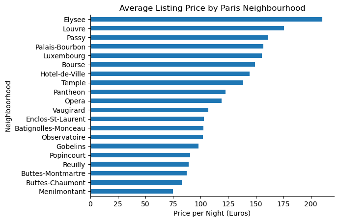
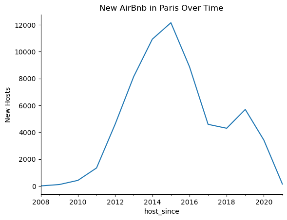
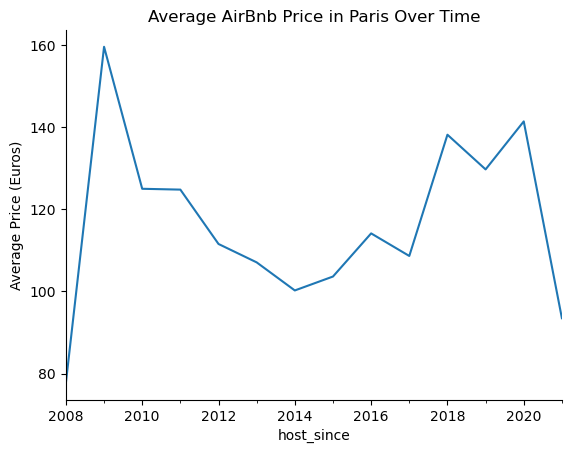

# 🏠 Airbnb Listings Analysis — Paris

An exploratory data analysis of Airbnb listings in Paris, looking at how nightly prices vary by neighbourhood and guest capacity, and how the market changed over time — including the impact of the 2015 short-term rental regulations.


## 📋 Overview

The notebook filters a global Airbnb listings dataset down to **Paris**, keeps the fields relevant to pricing (`host_since`, `neighbourhood`, `city`, `accommodates`, `price`), and answers three questions:

1. Which Paris neighbourhoods are the most expensive?
2. How does price change with the number of guests a listing accommodates?
3. How have the number of new hosts and the average price changed year over year?

## 📈 Charts

Charts produced by the notebook.

<p align="center"></p>

<p align="center">
  
  
</p>

## 🔍 Analysis Steps

| Step | What was done |
|------|---------------|
| **Data import** | Loaded the listings CSV with `ISO-8859-1` encoding and parsed `host_since` as a date |
| **Quality checks** | Checked missing values (33 listings missing `host_since`) and found 54 listings with both `price` and `accommodates` equal to 0 |
| **Neighbourhood pricing** | Grouped by neighbourhood and averaged the nightly price |
| **Capacity pricing** | Focused on the most expensive neighbourhood (Élysée) and averaged price by guest capacity |
| **Time series** | Resampled by year to count new hosts and average price per year |
| **Visualisation** | Bar charts and line charts, plus a dual-axis chart comparing new hosts against price |

## 📊 Key Findings

- **Élysée is the priciest neighbourhood** at roughly **€211/night** on average, followed by Louvre (~€175), Passy (~€161), Palais-Bourbon (~€157) and Luxembourg (~€156).
- **Price rises with capacity** — in Élysée, single-guest listings average about €80/night while 4-guest listings average about €212.
- **Rapid growth, then a slowdown** — new Paris hosts grew from 4 in 2008 to over 4,500 in 2012.
- **2015 regulations** — the final chart shows new host sign-ups falling after the 2015 rules came in, while average prices rose.

## 📁 Repository Contents

```
├── Airbnb_Listings_Analysis.ipynb   # Full analysis notebook
└── README.md
```

> The source dataset (`Listings_utf8.csv`) is not included in this repo because of its size. The notebook expects it in the same folder.

## 🚀 How to Run

```bash
pip install pandas matplotlib seaborn jupyter
jupyter notebook Airbnb_Listings_Analysis.ipynb
```

## 🛠️ Skills Demonstrated

Data cleaning · method chaining in pandas · `groupby` / `agg` · time-series resampling · data visualisation · drawing business conclusions from data

---

👤 **Tony Mulunda** — [GitHub @Scarface96](https://github.com/Scarface96)

## About This Project

A portfolio data-analysis project that turns Airbnb listing data into actionable insights about pricing, neighbourhood performance, guest capacity and market trends. It demonstrates practical Python, pandas, time-series analysis and data visualisation skills while connecting analytical findings to real-world marketplace decisions.
